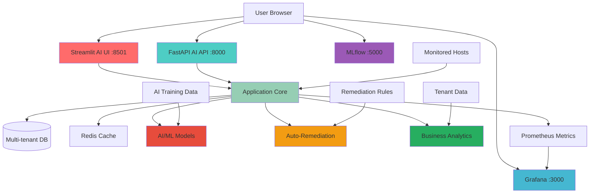

🚀 MASK PING ENGINE - Complete Deployment Guide

https://img.shields.io/badge/Version-4.0-blue
https://img.shields.io/badge/Python-3.9%2B-green
https://img.shields.io/badge/AI-Powered-purple
https://img.shields.io/badge/Docker-Ready-blue
https://img.shields.io/badge/Kubernetes-Compatible-orange

Enterprise-grade AI-powered monitoring system with anomaly detection, auto-remediation, business analytics, and professional dashboards.

---

📋 Quick Navigation

· 🌟 AI-Powered Features
·📊 System Architecture
·🚀 Quick Start (5 Minutes)
·🔧 All Deployment Options
·🤖 AI/ML Configuration
·⚡ Auto-Remediation Setup
·💼 Business Analytics
·🏢 Multi-Tenancy
·🔐 Security Guide
·📊 Performance Scaling
·🛠️ Troubleshooting
·🤝 Contributing

---

🌟 NEW: AI-Powered Features

🤖 Artificial Intelligence & Machine Learning

· ✅ AI Anomaly Detection - Isolation Forest & DBSCAN algorithms
· ✅ Predictive Maintenance - Failure prediction using historical patterns
· ✅ Pattern Recognition - Identify recurring issues automatically
· ✅ Auto-Baselining - Learn normal behavior for each host
· ✅ Model Management - Train, retrain, and manage ML models
· ✅ Real-time Scoring - Anomaly scores for every monitoring check

⚡ Auto-Remediation Engine

· ✅ Rule-based Automation - YAML-defined remediation rules
· ✅ Multiple Action Types - Restart, scale, failover, clear cache
· ✅ Remediation History - Track all automated actions
· ✅ Success Rate Analytics - Measure remediation effectiveness
· ✅ Integration with Alerts - Automatically trigger remediation

💼 Business Analytics & ROI

· ✅ ROI Calculator - Return on Investment analysis
· ✅ Cost Optimization - Identify over-monitored resources
· ✅ SLA Compliance Tracking - Monitor service level agreements
· ✅ Executive Reports - Business-friendly summaries
· ✅ Cost vs Benefit Analysis - Financial impact visualization
· ✅ Break-even Analysis - Calculate monitoring ROI

🏢 Enhanced Enterprise Features

· ✅ Multi-Tenancy - Full tenant isolation with quotas
· ✅ Enhanced Security - MFA, audit logging, threat detection
· ✅ Scalability - Horizontal scaling with clustering
· ✅ Business Impact Scoring - Quantify outage costs
· ✅ Compliance Ready - Audit trails for regulations

---

📊 System Architecture



Ports Used:

· 8501 - Streamlit AI Web Interface
· 8000 - FastAPI REST API with AI endpoints
· 3000 - Grafana Dashboard (Docker only)
· 5000 - MLflow AI Model Tracking (Docker only)
· 9090 - Prometheus Server (Docker only)
· 6379 - Redis Cache & Session Store
· 5432 - PostgreSQL for Analytics (Optional)

---

🚀 Quick Start (5 Minutes)

Option A: Docker Compose with AI (Recommended)

```bash
# 1. Download and generate AI-powered stack
git clone https://github.com/maskintelligence-gif/MASK-PING-ENGINE-.git
cd enterprise-monitor-ai

# 2. Generate Docker files with AI features
python terminal_ping_enterprise_enhanced.py --mode docker

# 3. Start all services including AI
docker-compose up -d

# 4. Access the AI-powered dashboard
echo "🚀 AI Web UI:      http://localhost:8501"
echo "📊 API Docs:       http://localhost:8000/docs"
echo "🤖 MLflow (AI):    http://localhost:5000"
echo "📈 Grafana:        http://localhost:3000 (admin/admin)"
echo "⚡ Prometheus:     http://localhost:9090"
```

Option B: Direct Python with AI Features

```bash
# 1. Install AI-enhanced dependencies
pip install streamlit fastapi uvicorn pandas plotly requests redis psutil scikit-learn mlflow

# 2. Enable AI features in config
cat > config.yaml << 'EOF'
enable_ai_anomaly_detection: true
enable_auto_remediation: true
enable_business_analytics: true
enable_multi_tenancy: true
EOF

# 3. Run with all AI features
python terminal_ping_enterprise_enhanced.py --mode both

# 4. Access AI features
echo "🤖 AI Dashboard: http://localhost:8501 → AI Insights tab"
echo "⚡ Auto-Remediation: http://localhost:8501 → Auto-Remediation tab"
echo "💼 Business Analytics: http://localhost:8501 → Business Analytics tab"
```

---

🔧 All Deployment Options

1. AI Development Mode

```bash
# Start with all AI features enabled
python terminal_ping_enterprise_enhanced.py --mode both \
  --config ai_config.yaml

# Custom AI configuration example
cat > ai_config.yaml << 'EOF'
enable_ai_anomaly_detection: true
ai_model_path: "models/anomaly_detector.pkl"
anomaly_detection_threshold: 0.7
enable_auto_remediation: true
remediation_rules_path: "config/remediation_rules.yaml"
enable_business_analytics: true
cost_per_check: 0.001
enable_multi_tenancy: true
default_tenant_id: "default"
EOF
```

2. Docker with AI Models

```bash
# Build AI-enhanced Docker image
docker build -t enterprise-monitor-ai:latest .

# Run with AI features
docker run -d \
  -p 8501:8501 \
  -p 8000:8000 \
  -p 5000:5000 \
  -v ./models:/app/models \
  -v ./ai_config.yaml:/app/config.yaml \
  -v ./remediation_rules:/app/config \
  -e ENABLE_AI=true \
  -e ENABLE_REMEDIATION=true \
  -e ENABLE_BUSINESS_ANALYTICS=true \
  --name monitor-ai \
  enterprise-monitor-ai:latest
```

3. Docker Compose AI Stack

```yaml
# docker-compose.ai.yml
version: '3.8'
services:
  monitor-ai:
    image: enterprise-monitor-ai:latest
    ports:
      - "8501:8501"
      - "8000:8000"
      - "5000:5000"
    environment:
      - ENABLE_AI=true
      - ENABLE_REMEDIATION=true
      - ENABLE_BUSINESS_ANALYTICS=true
      - ENABLE_MULTITENANCY=true
      - MLFLOW_TRACKING_URI=http://mlflow:5000
    volumes:
      - ./models:/app/models
      - ./ai_data:/app/ai_data
      - ./remediation_logs:/app/logs/remediation
  
  mlflow:
    image: ghcr.io/mlflow/mlflow:latest
    ports:
      - "5000:5000"
    volumes:
      - mlflow_data:/mlflow
    command: mlflow server --backend-store-uri sqlite:///mlflow.db --default-artifact-root ./artifacts --host 0.0.0.0
  
  redis:
    image: redis:7-alpine
    command: redis-server --appendonly yes --maxmemory 2gb --maxmemory-policy allkeys-lru
  
  prometheus:
    image: prom/prometheus:latest
  
  grafana:
    image: grafana/grafana:latest
```

4. Kubernetes with AI

```yaml
# kubernetes/ai-deployment.yaml
apiVersion: apps/v1
kind: Deployment
metadata:
  name: enterprise-monitor-ai
  labels:
    app: enterprise-monitor
    version: ai
spec:
  replicas: 3
  selector:
    matchLabels:
      app: enterprise-monitor
      version: ai
  template:
    metadata:
      labels:
        app: enterprise-monitor
        version: ai
    spec:
      containers:
      - name: monitor
        image: enterprise-monitor-ai:latest
        ports:
        - containerPort: 8501
          name: web-ui
        - containerPort: 8000
          name: api
        - containerPort: 5000
          name: mlflow
        env:
        - name: ENABLE_AI
          value: "true"
        - name: AI_MODEL_PATH
          value: "/models/anomaly_detector.pkl"
        - name: KUBERNETES_NAMESPACE
          valueFrom:
            fieldRef:
              fieldPath: metadata.namespace
        volumeMounts:
        - name: models
          mountPath: /app/models
        - name: remediation-rules
          mountPath: /app/config
        resources:
          requests:
            memory: "1Gi"
            cpu: "500m"
          limits:
            memory: "2Gi"
            cpu: "1000m"
      volumes:
      - name: models
        persistentVolumeClaim:
          claimName: models-pvc
      - name: remediation-rules
        configMap:
          name: remediation-rules
```

5. Systemd Service with AI

```bash
# /etc/systemd/system/enterprise-monitor-ai.service
[Unit]
Description=Enterprise Monitor Pro AI Edition
After=network.target redis.service
Requires=redis.service

[Service]
Type=simple
User=ai-monitor
Group=ai-monitor
WorkingDirectory=/opt/enterprise-monitor-ai
Environment=ENABLE_AI=true
Environment=ENABLE_REMEDIATION=true
Environment=AI_MODEL_PATH=/opt/enterprise-monitor-ai/models
Environment=REDIS_HOST=localhost
ExecStart=/usr/bin/python3 terminal_ping_enterprise_enhanced.py --mode both
Restart=always
RestartSec=10

[Install]
WantedBy=multi-user.target

# Create AI-specific user
sudo useradd -r -s /bin/false ai-monitor
sudo mkdir -p /opt/enterprise-monitor-ai/models
sudo chown -R ai-monitor:ai-monitor /opt/enterprise-monitor-ai
```

---

🤖 AI/ML Configuration

1. AI Anomaly Detection Setup

```yaml
# config.yaml - AI Configuration
ai:
  enabled: true
  model_path: "models/anomaly_detector.pkl"
  training:
    enabled: true
    interval_hours: 24
    training_hours: 168  # 7 days of data
    min_samples: 100
  detection:
    threshold: 0.7
    algorithms:
      - isolation_forest
      - dbscan
      - auto_encoder
  features:
    - response_time
    - success_rate
    - hour_of_day
    - day_of_week
    - historical_baseline
```

2. Training AI Models

```bash
# Manual training for specific host
curl -X POST http://localhost:8000/api/v1/ai/train \
  -H "X-API-Key: YOUR_KEY" \
  -d '{"host_id": 1, "training_hours": 168}'

# Batch train all hosts
curl -X POST http://localhost:8000/api/v1/ai/train-all \
  -H "X-API-Key: YOUR_KEY"

# Check model status
curl http://localhost:8000/api/v1/ai/models \
  -H "X-API-Key: YOUR_KEY"

# Get anomaly predictions
curl http://localhost:8000/api/v1/ai/predictions \
  -H "X-API-Key: YOUR_KEY"
```

3. MLflow Integration

```bash
# Access MLflow UI
echo "MLflow Tracking UI: http://localhost:5000"

# Track experiment
import mlflow
mlflow.set_tracking_uri("http://localhost:5000")
mlflow.set_experiment("anomaly_detection")

with mlflow.start_run():
    mlflow.log_param("algorithm", "IsolationForest")
    mlflow.log_metric("precision", 0.95)
    mlflow.log_metric("recall", 0.92)
    mlflow.sklearn.log_model(model, "model")
```

4. Custom AI Algorithms

```python
# Add custom anomaly detection algorithm
from enterprise_monitor.ai.base import BaseAnomalyDetector

class CustomAnomalyDetector(BaseAnomalyDetector):
    def detect(self, features):
        # Your custom algorithm
        return anomaly_score, is_anomaly
    
    def train(self, historical_data):
        # Your training logic
        self.model = trained_model

# Register in config
ai:
  custom_algorithms:
    - name: "custom_detector"
      class: "enterprise_monitor.ai.custom.CustomAnomalyDetector"
      enabled: true
```

---

⚡ Auto-Remediation Setup

1. Remediation Rules Configuration

```yaml
# config/remediation_rules.yaml
rules:
  high_response_time:
    name: "High Response Time Remediation"
    condition: "response_time > 5000"
    duration: "5 minutes"
    action: "restart_service"
    parameters:
      service_name: "nginx"
      restart_method: "systemctl"
    enabled: true
    severity: "warning"
  
  service_down:
    name: "Service Down Remediation"
    condition: "success = false"
    duration: "3 consecutive checks"
    action: "restart_service"
    parameters:
      service_name: "${host_name}"
      max_attempts: 3
    enabled: true
    severity: "critical"
  
  memory_high:
    name: "High Memory Usage"
    condition: "memory_percent > 90"
    duration: "2 minutes"
    action: "clear_cache"
    enabled: true
    severity: "warning"
  
  disk_full:
    name: "Disk Space Critical"
    condition: "disk_percent > 95"
    duration: "immediate"
    action: "cleanup_logs"
    parameters:
      log_dirs: ["/var/log", "/tmp"]
      max_age_days: 7
    enabled: true
    severity: "critical"
  
  ssl_expiring:
    name: "SSL Certificate Expiring"
    condition: "ssl_days_remaining < 7"
    duration: "immediate"
    action: "notify_admin"
    parameters:
      channels: ["email", "slack"]
      urgency: "high"
    enabled: true
    severity: "warning"
```

2. Remediation Actions

```python
# Custom remediation action
from enterprise_monitor.remediation.base import BaseRemediationAction

class ScaleServiceAction(BaseRemediationAction):
    def execute(self, host, alert, parameters):
        # Scale Kubernetes deployment
        from kubernetes import client, config
        config.load_kube_config()
        
        api = client.AppsV1Api()
        deployment = api.read_namespaced_deployment(
            name=parameters['deployment'],
            namespace=parameters['namespace']
        )
        
        # Scale up
        deployment.spec.replicas = parameters['replicas']
        api.replace_namespaced_deployment(
            name=parameters['deployment'],
            namespace=parameters['namespace'],
            body=deployment
        )
        
        return True, "Scaled deployment successfully"

# Register custom action
remediation_actions:
  scale_service:
    class: "enterprise_monitor.remediation.scale.ScaleServiceAction"
    enabled: true
```

3. Testing Remediation

```bash
# Test remediation rule
curl -X POST http://localhost:8000/api/v1/remediation/test \
  -H "X-API-Key: YOUR_KEY" \
  -d '{
    "rule_name": "high_response_time",
    "test_data": {
      "response_time": 6000,
      "host": "web-server-1"
    }
  }'

# View remediation history
curl http://localhost:8000/api/v1/remediation/history \
  -H "X-API-Key: YOUR_KEY"

# Disable/enable rules
curl -X PATCH http://localhost:8000/api/v1/remediation/rules/high_response_time \
  -H "X-API-Key: YOUR_KEY" \
  -d '{"enabled": false}'
```

4. Remediation Dashboard

```bash
# Access remediation dashboard
echo "Remediation Dashboard: http://localhost:8501 → Auto-Remediation tab"

# Key metrics to monitor:
# - Success rate
# - Average time to remediate
# - Most common issues
# - Cost savings from automation
```

---

💼 Business Analytics Setup

1. ROI Configuration

```yaml
# config/business_analytics.yaml
roi:
  enabled: true
  cost_calculation:
    cost_per_check: 0.001
    infrastructure_cost_per_host: 5.0  # $ per month
    labor_cost_per_incident: 50.0
  benefits:
    downtime_prevention_value: 1000.0  # $ per hour
    sla_penalty_avoidance: 5000.0
    productivity_gain: 2000.0
  reporting:
    frequency: "monthly"
    recipients:
      - "executives@company.com"
      - "finance@company.com"
    formats:
      - "pdf"
      - "excel"
      - "json"
```

2. SLA Configuration

```yaml
sla:
  default:
    uptime: 99.9
    response_time: 100  # ms
    error_rate: 0.1
  tiers:
    platinum:
      uptime: 99.99
      response_time: 50
      error_rate: 0.01
      penalty_per_violation: 10000
    gold:
      uptime: 99.9
      response_time: 100
      error_rate: 0.1
      penalty_per_violation: 5000
    silver:
      uptime: 99.5
      response_time: 200
      error_rate: 0.5
      penalty_per_violation: 1000
```

3. Business Reports

```bash
# Generate ROI report
curl -X POST http://localhost:8000/api/v1/business/reports/roi \
  -H "X-API-Key: YOUR_KEY" \
  -d '{
    "start_date": "2024-01-01",
    "end_date": "2024-01-31",
    "format": "pdf"
  }'

# Get cost analysis
curl http://localhost:8000/api/v1/business/costs \
  -H "X-API-Key: YOUR_KEY"

# Executive summary
curl http://localhost:8000/api/v1/business/executive-summary \
  -H "X-API-Key: YOUR_KEY"
```

4. Dashboard Access

```bash
# Business Analytics Dashboard
echo "Business Dashboard: http://localhost:8501 → Business Analytics tab"

# Key sections:
# - ROI Calculator
# - Cost Optimization
# - SLA Compliance
# - Executive Reports
```

---

🏢 Multi-Tenancy Setup

1. Tenant Configuration

```yaml
# config/tenants.yaml
tenants:
  default:
    name: "Default Tenant"
    description: "System default tenant"
    quota:
      max_hosts: 100
      max_checks_per_hour: 1000
      data_retention_days: 90
      max_users: 10
    billing:
      plan: "enterprise"
      cost_per_host: 10.0
      cost_per_check: 0.001
  
  acme_corp:
    name: "Acme Corporation"
    description: "Production monitoring"
    quota:
      max_hosts: 1000
      max_checks_per_hour: 10000
      data_retention_days: 365
      max_users: 50
    billing:
      plan: "platinum"
      cost_per_host: 15.0
      cost_per_check: 0.0005
  
  startup_xyz:
    name: "Startup XYZ"
    description: "Startup monitoring package"
    quota:
      max_hosts: 50
      max_checks_per_hour: 500
      data_retention_days: 30
      max_users: 5
    billing:
      plan: "basic"
      cost_per_host: 5.0
      cost_per_check: 0.002
```

2. Tenant Management API

```bash
# Create new tenant
curl -X POST http://localhost:8000/api/v1/tenants \
  -H "X-API-Key: ADMIN_KEY" \
  -d '{
    "tenant_id": "new_customer",
    "name": "New Customer Inc",
    "quota_hosts": 200,
    "quota_checks_per_hour": 2000
  }'

# Get tenant usage
curl http://localhost:8000/api/v1/tenants/acme_corp/usage \
  -H "X-API-Key: ADMIN_KEY"

# Update tenant quota
curl -X PATCH http://localhost:8000/api/v1/tenants/acme_corp \
  -H "X-API-Key: ADMIN_KEY" \
  -d '{"quota_hosts": 1500}'
```

3. Tenant Isolation

```python
# Database queries automatically scoped by tenant
# Example: Get hosts for current tenant
with db.get_connection(tenant_id) as conn:
    hosts = conn.execute(
        "SELECT * FROM hosts WHERE tenant_id = ? AND enabled = 1",
        (tenant_id,)
    ).fetchall()

# Redis cache keys include tenant ID
cache_key = f"metrics:{tenant_id}:{host_id}:24h"
```

4. Billing Integration

```python
# Calculate monthly bill for tenant
def calculate_monthly_bill(tenant_id):
    with db.get_connection() as conn:
        # Get tenant pricing
        tenant = conn.execute(
            "SELECT billing_plan FROM tenants WHERE id = ?",
            (tenant_id,)
        ).fetchone()
        
        # Get usage
        usage = conn.execute("""
            SELECT COUNT(DISTINCT host_id) as host_count,
                   COUNT(*) as check_count
            FROM monitoring_results 
            WHERE tenant_id = ? 
              AND created_at > datetime('now', '-30 days')
        """, (tenant_id,)).fetchone()
        
        # Calculate costs
        cost = (usage['host_count'] * tenant['cost_per_host'] +
                usage['check_count'] * tenant['cost_per_check'])
        
        return {
            'tenant_id': tenant_id,
            'period': 'monthly',
            'host_count': usage['host_count'],
            'check_count': usage['check_count'],
            'total_cost': cost,
            'currency': 'USD'
        }
```

---

🔐 Security Guide for AI Edition

1. AI Model Security

```bash
# Secure AI model storage
chmod 600 models/anomaly_detector.pkl
chown ai-monitor:ai-monitor models/
chmod 700 models/

# Encrypt sensitive training data
from cryptography.fernet import Fernet
key = Fernet.generate_key()
cipher = Fernet(key)

# Encrypt before storage
encrypted_data = cipher.encrypt(training_data)
with open('models/encrypted_training.bin', 'wb') as f:
    f.write(encrypted_data)

# Model validation before loading
import pickle
import hashlib

def safe_load_model(path, expected_hash):
    with open(path, 'rb') as f:
        data = f.read()
        if hashlib.sha256(data).hexdigest() != expected_hash:
            raise SecurityError("Model integrity check failed")
        return pickle.loads(data)
```

2. API Security for AI Endpoints

```python
# Rate limiting for AI endpoints
from fastapi import Depends, HTTPException
from slowapi import Limiter, _rate_limit_exceeded_handler
from slowapi.util import get_remote_address

limiter = Limiter(key_func=get_remote_address)

@app.post("/api/v1/ai/analyze")
@limiter.limit("10/minute")
async def analyze_with_ai(
    request: AIAnalysisRequest,
    api_key: str = Depends(validate_api_key)
):
    # AI analysis requires enhanced permissions
    if not has_permission(api_key, 'ai_analysis'):
        raise HTTPException(status_code=403, detail="AI analysis not permitted")
    
    return await ai_analyzer.analyze(request)

# Request validation for AI endpoints
from pydantic import BaseModel, validator

class AIAnalysisRequest(BaseModel):
    host_id: int
    time_window_hours: int = 24
    
    @validator('time_window_hours')
    def validate_time_window(cls, v):
        if v > 744:  # 31 days max
            raise ValueError('Time window too large')
        return v
```

3. Audit Logging for AI Actions

```yaml
# config/audit.yaml
audit:
  ai_actions:
    enabled: true
    log_level: "INFO"
    events:
      - model_training
      - anomaly_detection
      - prediction_made
      - model_retraining
      - false_positive
      - false_negative
  retention:
    days: 365
    max_size: "10GB"
  destinations:
    - file: "/var/log/ai_audit.log"
    - syslog: true
    - elasticsearch:
        host: "elasticsearch.local"
        index: "ai-audit"
```

4. GDPR Compliance for AI

```python
# Data anonymization for AI training
import hashlib

def anonymize_training_data(data):
    # Hash sensitive fields
    data['host_id'] = hashlib.sha256(
        str(data['host_id']).encode()
    ).hexdigest()[:16]
    
    # Remove PII
    if 'user_data' in data:
        del data['user_data']
    
    # Aggregate time precision
    data['timestamp'] = data['timestamp'].replace(
        minute=0, second=0, microsecond=0
    )
    
    return data

# Right to explanation for AI decisions
def explain_anomaly_detection(anomaly_score, features):
    explanation = {
        'score': anomaly_score,
        'key_factors': [],
        'confidence': 0.0,
        'recommendations': []
    }
    
    # Identify contributing factors
    if features['response_time'] > 5000:
        explanation['key_factors'].append(
            f"High response time: {features['response_time']}ms"
        )
    
    if features.get('error_rate', 0) > 0.1:
        explanation['key_factors'].append(
            f"High error rate: {features['error_rate']*100}%"
        )
    
    # Provide actionable recommendations
    if anomaly_score > 0.8:
        explanation['recommendations'].extend([
            "Check server resource utilization",
            "Review recent application logs",
            "Verify network connectivity"
        ])
    
    return explanation
```

5. MFA Configuration

```yaml
# config/mfa.yaml
mfa:
  enabled: true
  required_for:
    - admin_users
    - ai_operations
    - remediation_actions
    - tenant_management
  methods:
    - totp:
        issuer: "Enterprise Monitor AI"
        digits: 6
        period: 30
    - email:
        enabled: true
        template: "mfa_email.html"
    - sms:
        enabled: false  # Requires SMS gateway
  backup_codes:
    enabled: true
    count: 10
    length: 8
```

---

📊 Performance Scaling for AI Edition

1. AI Model Performance

```yaml
# config/ai_performance.yaml
ai_performance:
  model_caching:
    enabled: true
    cache_size: 10
    ttl_minutes: 60
  batch_processing:
    enabled: true
    batch_size: 100
    max_queue_size: 1000
  resource_limits:
    max_training_concurrent: 2
    max_prediction_concurrent: 10
    memory_limit_mb: 2048
    cpu_limit_percent: 50
  optimization:
    quantization: true
    pruning: true
    use_gpu: false  # Set to true if CUDA available
```

2. Horizontal Scaling with AI

```yaml
# docker-compose.scale.ai.yml
version: '3.8'
services:
  monitor-ai-worker:
    image: enterprise-monitor-ai:latest
    deploy:
      replicas: 3
      resources:
        limits:
          cpus: '2'
          memory: 4G
        reservations:
          cpus: '1'
          memory: 2G
    command: python -m enterprise_monitor.ai.worker
    environment:
      - NODE_TYPE=ai_worker
      - REDIS_HOST=redis
      - MODEL_PATH=/shared/models
      - QUEUE_NAME=ai_tasks
    volumes:
      - shared_models:/shared/models
  
  monitor-api:
    image: enterprise-monitor-ai:latest
    deploy:
      replicas: 2
    command: python -m enterprise_monitor.api
    environment:
      - NODE_TYPE=api
      - AI_WORKER_URL=monitor-ai-worker
    ports:
      - "8000:8000"
  
  monitor-ui:
    image: enterprise-monitor-ai:latest
    command: python -m enterprise_monitor.ui
    ports:
      - "8501:8501"
  
  redis-cluster:
    image: redis:7-alpine
    command: redis-server --cluster-enabled yes --cluster-config-file nodes.conf
    deploy:
      replicas: 3
```

3. Database Optimization for AI

```sql
-- PostgreSQL optimization for AI workloads
-- Create specialized tables for AI data
CREATE TABLE ai_training_data (
    id BIGSERIAL PRIMARY KEY,
    tenant_id VARCHAR(50) NOT NULL,
    host_id INTEGER NOT NULL,
    features JSONB NOT NULL,
    label BOOLEAN,
    created_at TIMESTAMP DEFAULT CURRENT_TIMESTAMP,
    INDEX idx_ai_tenant_host (tenant_id, host_id),
    INDEX idx_ai_features USING gin (features)
) PARTITION BY RANGE (created_at);

-- Create monthly partitions
CREATE TABLE ai_training_data_2024_01 
PARTITION OF ai_training_data 
FOR VALUES FROM ('2024-01-01') TO ('2024-02-01');

-- Create materialized views for common AI queries
CREATE MATERIALIZED VIEW mv_ai_host_features AS
SELECT 
    tenant_id,
    host_id,
    AVG((features->>'response_time')::FLOAT) as avg_response_time,
    COUNT(*) as sample_count,
    MAX(created_at) as last_training
FROM ai_training_data
WHERE created_at > NOW() - INTERVAL '7 days'
GROUP BY tenant_id, host_id
WITH DATA;

-- Refresh materialized view every hour
CREATE OR REPLACE FUNCTION refresh_ai_views()
RETURNS void AS $$
BEGIN
    REFRESH MATERIALIZED VIEW CONCURRENTLY mv_ai_host_features;
END;
$$ LANGUAGE plpgsql;

-- Schedule refresh
SELECT cron.schedule('refresh-ai-views', '0 * * * *', 
    'SELECT refresh_ai_views();');
```

4. Monitoring AI Performance

```bash
# AI-specific Prometheus metrics
# Add to prometheus.yml
scrape_configs:
  - job_name: 'ai-metrics'
    static_configs:
      - targets: ['monitor-ai-worker:8000']
    metrics_path: '/ai/metrics'
    scrape_interval: 30s

# Key AI metrics to monitor
curl http://localhost:8000/ai/metrics

# Expected metrics:
# ai_model_training_duration_seconds
# ai_predictions_total
# ai_anomaly_detection_accuracy
# ai_model_cache_hits_total
# ai_worker_queue_length
```

---

🛠️ Troubleshooting AI Edition

1. AI Model Issues

```bash
# Check AI model status
curl http://localhost:8000/api/v1/ai/status

# Test model prediction
curl -X POST http://localhost:8000/api/v1/ai/test \
  -H "X-API-Key: YOUR_KEY" \
  -d '{
    "host_id": 1,
    "features": {
      "response_time": 150,
      "success": true,
      "hour_of_day": 14
    }
  }'

# View model training logs
docker-compose logs monitor-ai-worker | grep -i "training"

# Check model file integrity
python -c "
import pickle
import hashlib
with open('models/anomaly_detector.pkl', 'rb') as f:
    data = f.read()
    print(f'File size: {len(data)} bytes')
    print(f'SHA256: {hashlib.sha256(data).hexdigest()}')
    try:
        model = pickle.loads(data)
        print('Model loaded successfully')
        print(f'Model type: {type(model)}')
    except Exception as e:
        print(f'Error loading model: {e}')
"
```

2. Auto-Remediation Issues

```bash
# Check remediation rule syntax
python -c "
import yaml
with open('config/remediation_rules.yaml', 'r') as f:
    rules = yaml.safe_load(f)
    print(f'Loaded {len(rules.get(\"rules\", {}))} rules')
    for name, rule in rules.get('rules', {}).items():
        print(f'{name}: {rule.get(\"enabled\", False)}')
"

# Test remediation action
curl -X POST http://localhost:8000/api/v1/remediation/test-action \
  -H "X-API-Key: YOUR_KEY" \
  -d '{
    "action": "restart_service",
    "parameters": {
      "service_name": "nginx",
      "host": "test-server"
    }
  }'

# View remediation logs
docker-compose logs monitor | grep -i "remediation"

# Check remediation history
sqlite3 /data/monitor.db "
SELECT action_type, status, COUNT(*) 
FROM remediation_logs 
WHERE executed_at > datetime('now', '-1 day')
GROUP BY action_type, status;
"
```

3. Business Analytics Issues

```bash
# Check ROI calculation
curl http://localhost:8000/api/v1/business/roi/calculate \
  -H "X-API-Key: YOUR_KEY" \
  -d '{
    "start_date": "2024-01-01",
    "end_date": "2024-01-07"
  }'

# Verify SLA data
sqlite3 /data/monitor.db "
SELECT host_id, compliance_score, sla_uptime_violation
FROM sla_compliance 
ORDER BY period_start DESC 
LIMIT 10;
"

# Check cost calculations
curl http://localhost:8000/api/v1/business/costs/breakdown \
  -H "X-API-Key: YOUR_KEY"
```

4. Multi-Tenancy Issues

```bash
# Check tenant isolation
curl http://localhost:8000/api/v1/tenants/default/hosts \
  -H "X-API-Key: TENANT_KEY"

# Verify tenant quotas
sqlite3 /data/monitor.db "
SELECT tenant_id, COUNT(*) as host_count
FROM hosts 
WHERE enabled = 1
GROUP BY tenant_id;
"

# Check cross-tenant data leakage
python -c "
from enterprise_monitor.db import DatabaseManager
db = DatabaseManager()
with db.get_connection('tenant_a') as conn:
    hosts = conn.execute('SELECT * FROM hosts').fetchall()
    print(f'Tenant A hosts: {len(hosts)}')
with db.get_connection('tenant_b') as conn:
    hosts = conn.execute('SELECT * FROM hosts').fetchall()
    print(f'Tenant B hosts: {len(hosts)}')
"
```

5. Performance Issues

```bash
# Monitor AI worker performance
docker stats monitor-ai-worker

# Check Redis memory usage
redis-cli info memory | grep -E "(used_memory|maxmemory|evicted_keys)"

# Monitor database performance
sqlite3 /data/monitor.db "
SELECT 
    name,
    COUNT(*) as row_count,
    SUM(pgsize) as size_bytes
FROM dbstat 
GROUP BY name 
ORDER BY size_bytes DESC;
"

# Check queue lengths
curl http://localhost:8000/api/v1/queue/stats \
  -H "X-API-Key: YOUR_KEY"
```

---

🤝 Contributing to AI Edition

1. Adding New AI Algorithms

```python
# Create new anomaly detection algorithm
# File: enterprise_monitor/ai/custom_algorithms.py

from sklearn.ensemble import RandomForestClassifier
from .base import BaseAnomalyDetector

class RandomForestAnomalyDetector(BaseAnomalyDetector):
    """Random Forest based anomaly detection"""
    
    def __init__(self, config):
        super().__init__(config)
        self.n_estimators = config.get('n_estimators', 100)
        self.max_depth = config.get('max_depth', 10)
    
    def train(self, X, y=None):
        """Train the model"""
        self.model = RandomForestClassifier(
            n_estimators=self.n_estimators,
            max_depth=self.max_depth,
            n_jobs=-1,
            random_state=42
        )
        
        # For unsupervised, create synthetic anomalies
        if y is None:
            # Create synthetic labels
            from sklearn.model_selection import train_test_split
            from sklearn.utils import shuffle
            
            X_normal = X
            n_anomalies = int(len(X) * 0.1)  # 10% anomalies
            
            # Generate synthetic anomalies
            X_anomalies = self._generate_anomalies(X, n_anomalies)
            
            X_combined = np.vstack([X_normal, X_anomalies])
            y_combined = np.hstack([
                np.zeros(len(X_normal)),
                np.ones(len(X_anomalies))
            ])
            
            X_combined, y_combined = shuffle(X_combined, y_combined)
            self.model.fit(X_combined, y_combined)
        else:
            self.model.fit(X, y)
        
        return self
    
    def detect(self, X):
        """Detect anomalies"""
        probabilities = self.model.predict_proba(X)
        anomaly_scores = probabilities[:, 1]  # Probability of being anomaly
        
        return anomaly_scores
    
    def _generate_anomalies(self, X, n_samples):
        """Generate synthetic anomalies by perturbing normal data"""
        anomalies = []
        for _ in range(n_samples):
            # Randomly select a normal sample
            idx = np.random.randint(len(X))
            sample = X[idx].copy()
            
            # Perturb features
            perturbation = np.random.normal(0, 0.5, size=sample.shape)
            anomaly = sample + perturbation
            
            anomalies.append(anomaly)
        
        return np.array(anomalies)

# Register in config
ai_algorithms:
  random_forest:
    class: "enterprise_monitor.ai.custom_algorithms.RandomForestAnomalyDetector"
    parameters:
      n_estimators: 100
      max_depth: 10
    enabled: true
```

2. Adding New Remediation Actions

```python
# File: enterprise_monitor/remediation/cloud_actions.py

from .base import BaseRemediationAction
import boto3
from kubernetes import client, config

class CloudRemediationActions(BaseRemediationAction):
    """Cloud-specific remediation actions"""
    
    def aws_restart_ec2(self, host, alert, parameters):
        """Restart AWS EC2 instance"""
        ec2 = boto3.client('ec2', region_name=parameters['region'])
        
        response = ec2.reboot_instances(
            InstanceIds=[parameters['instance_id']],
            DryRun=parameters.get('dry_run', False)
        )
        
        return True, f"EC2 instance {parameters['instance_id']} restart initiated"
    
    def kubernetes_restart_pod(self, host, alert, parameters):
        """Restart Kubernetes pod"""
        config.load_kube_config()
        v1 = client.CoreV1Api()
        
        v1.delete_namespaced_pod(
            name=parameters['pod_name'],
            namespace=parameters['namespace'],
            body=client.V1DeleteOptions(
                propagation_policy='Foreground',
                grace_period_seconds=5
            )
        )
        
        return True, f"Pod {parameters['pod_name']} deletion initiated"
    
    def gcp_restart_vm(self, host, alert, parameters):
        """Restart Google Cloud VM instance"""
        from google.cloud import compute_v1
        
        instance_client = compute_v1.InstancesClient()
        operation = instance_client.reset(
            project=parameters['project'],
            zone=parameters['zone'],
            instance=parameters['instance']
        )
        
        return True, f"GCP VM {parameters['instance']} reset initiated"
```

3. Adding Business Analytics Metrics

```python
# File: enterprise_monitor/analytics/custom_metrics.py

from datetime import datetime, timedelta
import pandas as pd

class CustomBusinessMetrics:
    """Custom business analytics metrics"""
    
    def calculate_customer_satisfaction(self, tenant_id, period_days=30):
        """Calculate customer satisfaction score based on monitoring"""
        end_date = datetime.now()
        start_date = end_date - timedelta(days=period_days)
        
        with self.db.get_connection(tenant_id) as conn:
            # Get SLA compliance
            sla_compliance = conn.execute("""
                SELECT AVG(compliance_score) as avg_compliance
                FROM sla_compliance 
                WHERE tenant_id = ?
                  AND period_start >= ?
                  AND period_end <= ?
            """, (tenant_id, start_date, end_date)).fetchone()
            
            # Get alert response time
            alert_response = conn.execute("""
                SELECT AVG(
                    julianday(resolved_at) - julianday(created_at)
                ) * 24 * 60 as avg_response_minutes
                FROM alerts 
                WHERE tenant_id = ?
                  AND resolved = 1
                  AND created_at >= ?
            """, (tenant_id, start_date)).fetchone()
            
            # Calculate CSAT score (0-100)
            csat_score = 50  # Base score
            
            if sla_compliance and sla_compliance['avg_compliance']:
                csat_score += sla_compliance['avg_compliance'] * 0.3
            
            if alert_response and alert_response['avg_response_minutes']:
                if alert_response['avg_response_minutes'] < 5:
                    csat_score += 20
                elif alert_response['avg_response_minutes'] < 15:
                    csat_score += 10
            
            return min(100, csat_score)
    
    def predict_churn_risk(self, tenant_id):
        """Predict churn risk based on monitoring patterns"""
        with self.db.get_connection(tenant_id) as conn:
            # Get recent activity
            recent_activity = conn.execute("""
                SELECT COUNT(*) as check_count,
                       AVG(CASE WHEN success = 1 THEN 1 ELSE 0 END) as success_rate,
                       COUNT(DISTINCT host_id) as active_hosts
                FROM monitoring_results 
                WHERE tenant_id = ?
                  AND created_at > datetime('now', '-7 days')
            """, (tenant_id,)).fetchone()
            
            # Get SLA violations
            sla_violations = conn.execute("""
                SELECT COUNT(*) as violation_count
                FROM sla_compliance 
                WHERE tenant_id = ?
                  AND (sla_uptime_violation = 1 OR sla_response_violation = 1)
                  AND period_start > datetime('now', '-30 days')
            """, (tenant_id,)).fetchone()
            
            # Calculate churn risk (0-100)
            risk_score = 0
            
            if recent_activity:
                if recent_activity['check_count'] < 100:
                    risk_score += 20
                if recent_activity['success_rate'] < 0.95:
                    risk_score += 30
                if recent_activity['active_hosts'] == 0:
                    risk_score += 50
            
            if sla_violations and sla_violations['violation_count'] > 5:
                risk_score += min(50, sla_violations['violation_count'] * 5)
            
            return min(100, risk_score)
```

4. Testing Your Contributions

```bash
# Run AI algorithm tests
pytest tests/test_ai_algorithms.py -v

# Test remediation actions
pytest tests/test_remediation.py --cov=enterprise_monitor.remediation

# Test business analytics
pytest tests/test_analytics.py -k "test_customer_satisfaction"

# Run full test suite with AI features
pytest tests/ --cov=enterprise_monitor --cov-report=html

# Performance testing for new features
python -m pytest tests/ --benchmark-only
```

---

📞 Support for AI Edition

· GitHub Issues: Report bugs or request AI features
· Discord Community: Join AI/ML discussions
· Email Support: team@maskhosting.online
· Enterprise Support: Contact sales for AI consulting via support email.

📄 License

This project is licensed under the MIT License - see the LICENSE file for details.

Commercial AI Add-ons Available:

· Enterprise AI model training
· Custom anomaly detection algorithms
· Advanced predictive maintenance
· Business intelligence integration
· 24/7 AI operations support

🙏 Acknowledgments

· Scikit-learn team for the ML framework
· MLflow team for model tracking
· Streamlit team for the amazing web framework
· FastAPI team for high-performance API framework
· All contributors and users of Enterprise Monitor Pro AI Edition

---

Ready to deploy AI-powered monitoring? Start with the Quick Start (5 Minutes) section!

For AI/ML consulting and enterprise support, contact our team at team@maskhosting.online

Star the repository ⭐ to stay updated with the latest AI features!
